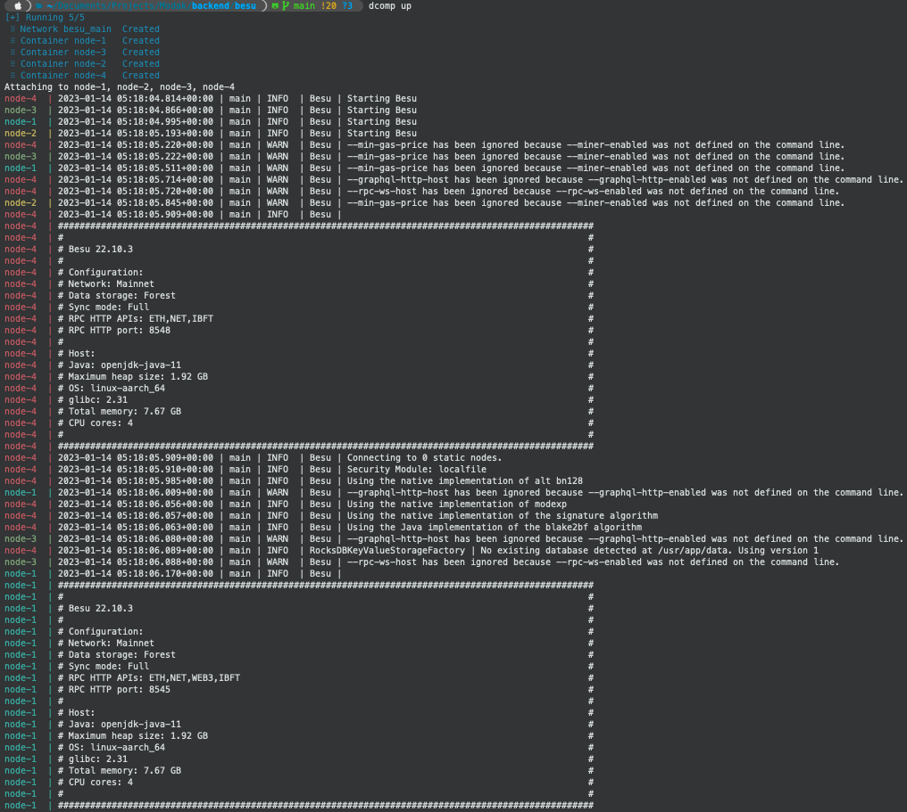

# Besu IBFT2 Private Blockchain

**Prerequisite**
- docker & docker compose
- puppeth and ethereum

## Steps
1. By using puppeth create the configuration file `genesis-generator/ibftConfigFile.json` or simply modify the provided one.
2. Use `docker-compose up` on `genesis-generator` to get the `networkFiles` with the following structure:
   ```
    genesis-generator/
    ├── accs
    ├── docker-compose.yaml
    ├── ibftConfigFile.json
    └── networkFiles
      ├── genesis.json
      └── keys
          ├── 0x2b6086eb1d4bc1ca8a174999d043d1376d8d0cfb
          │   ├── key
          │   └── key.pub
          ├── 0x601f594dcfb3b1894ad0912c60b30616e66a8532
          │   ├── key
          │   └── key.pub
          ├── 0x741ef9082b7e8ff512b040ffe05fdac3acd9077e
          │   ├── key
          │   └── key.pub
          └── 0x804687372100c581ead5e854394ea13e37f08d07
              ├── key
              └── key.pub
   ```
3. Copy the `key` file of each folder in `genesis-generator/networkFiles/keys` to each node data folder like this:
   ```
   cp genesis-generator/networkFiles/keys/0x2b6086eb1d4bc1ca8a174999d043d1376d8d0cfb/key ../node-1/data/key
   ```
4. Go into the `node-1` folder and start the container i.e., `docker-compose up`, and look for a line with the text `enode://` copy the long string, kill the container (i.e., `Ctrl-C`) and replace it on the `config.toml` at `node-2`, `node-3`, and `node-4`, at the `bootnodes` array (there is only one bootnode, `node-1`).
5. Kill the `node-1` container i.e., `docker-compose down` inside `node-1`.
6. Go back to this repo root, and start the whole project i.e., `docker-compose up`. You will see all the containers working together.



At any time you can clean the nodes by executing the `clean.sh` file. It will restart the whole blockchain.

## Readings
- [https://besu.hyperledger.org/en/stable/private-networks/how-to/configure/consensus/ibft/](https://besu.hyperledger.org/en/stable/private-networks/how-to/configure/consensus/ibft/)